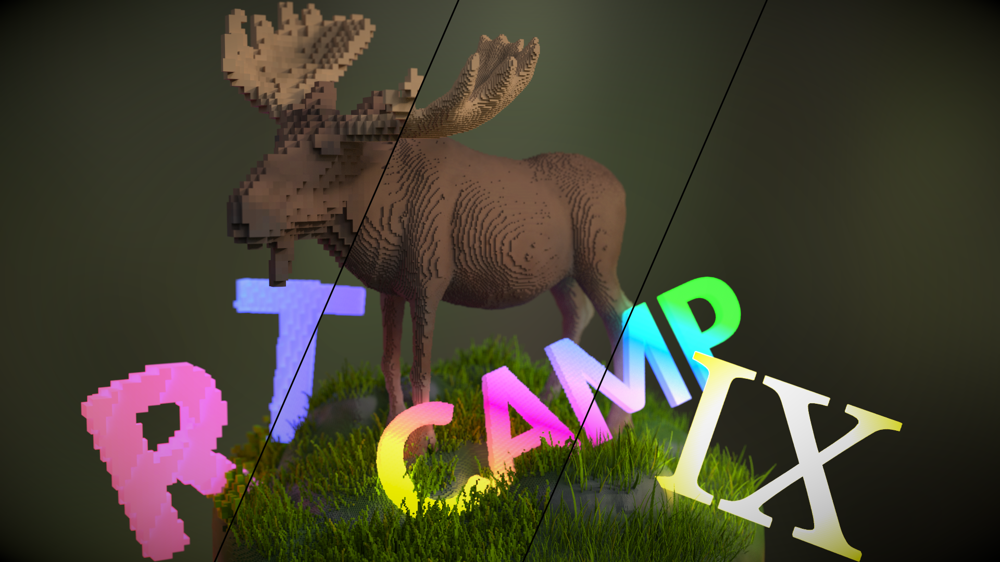

# Hako-1.0 Massive Voxel Renderer
Everything is Voxel. A renderer for the Ray Tracing Camp 9 ( https://sites.google.com/view/rtcamp9/home ). 



The short introduction: [renderer_introduction](usecase2_submission/renderer_introduction.pdf)

The short introduction audio: [ずんだもん.wav](usecase2_submission/ずんだもん.wav)

## Video
[A submitted video](submittedClip.mp4)

## Environment
AMD: Navi 10 or later ( vega10 or vega20 could work but I didn't really test it )
NVIDIA: compute capability 7.0 or later ( https://en.wikipedia.org/wiki/CUDA ) and need cuda SDK( 12.0 is used for the submission ) for nvrtc API

## Assets
The final scene ( rtcamp9.abc ) that is used for the submission. It also contains a zbrush project, obj geometry files, houdini project file to generate "rtcamp9.abc".

[rtcamp9Assets.zip](https://ushiobucket1.s3.ap-northeast-1.amazonaws.com/rtcamp9/rtcamp9Assets.zip)


## Build

```
git submodule update --init
premake5 vs2022
```

Open MassiveVoxelRayTracing.sln and build.

## Projects
| Project | Description |
|---------|---------|
| prlib   | [visualization library etc](https://github.com/Ushio/prlib) |
| RTCamp   | Final submission |
| unittest | Some tiny unit tests |
| voxMesh | Voxelization test on the CPU. You can save voxelized mesh as .ply |
| **voxPTGPU** | Path tracer. The main dev project. |
| voxRT | Ray cast test on the CPU |
| voxRTGPU | Ray cast test on the GPU |
| voxTriangle | A triangle voxelization test |


## seminor 
TBD

## Awesome References
### Voxelization
- Michael Schwarz, Hans-Peter Seidel, “Fast Parallel Surface and Solid Voxelization on GPUs”
- Jacopo Pantaleoni, “VoxelPipe: A Programmable Pipeline for 3D Voxelization”

### Octree
- J. Baert, A. Lagae and Ph. Dutré, “Out-of-Core Construction of Sparse Voxel Octrees”
- Martin Pätzold and Andreas Kolb, “Grid-Free Out-Of-Core Voxelization to Sparse Voxel Octrees on GPU”

### Ray Traversal
- John Amanatides and Andrew Woo, “A Fast Voxel Traversal Algorithm”
- Mark Agate, Richard L. Grimsdale and Paul F. Lister, “The HERO Algorithm for Ray-Tracing Octrees”
- J. Revelles, C. Urena, M. Lastra, “An Efficient Parametric Algorithm for Octree Traversal”
- A Recursive Approach for Octree Traversal, https://chiranjivi.tripod.com/octrav.html

### Color Handling
- Dan Dolonius, Erik Sintorny, Viktor Kampezand Ulf Assarsson, “Compressing Color Data for Voxelized Surface Geometry”
